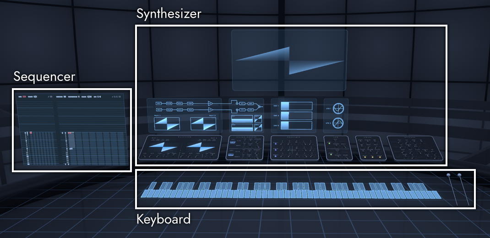

# Introduction

This document was translated using machine translation and may contain inaccuracies.

In this world, you can create sounds with the synthesizer, create a song with the sequencer, and play with the keyboard.
Various settings are made in the world menu.

For performance, input from an external MIDI keyboard is also supported.

## Arrangement of each part

There is a synthesizer in the back on the right, a sequencer to its left, and a keyboard in the front.
