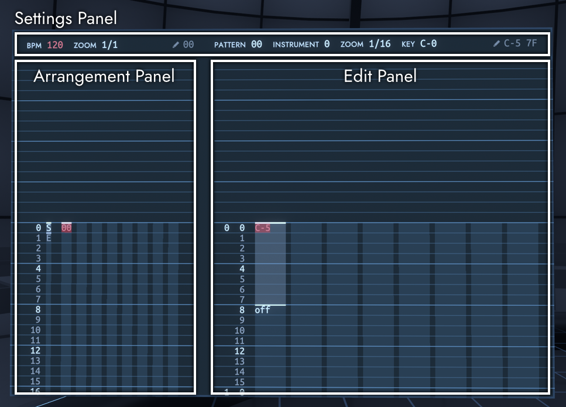

# シーケンサー

シンセサイザーの左側にあるシーケンサー画面では、楽曲の打ち込みを行うことができます。

FractoneではTrackerスタイルのシーケンサーを採用しています。
シーケンサーの操作ではレーザーポインターなどは使わず、カーソルの移動と値の書き込みをコントローラーで行います。

シーケンサーをインタラクトすると、両方のコントローラーの入力がシーケンサーに送られ、通常の移動操作ができなくなります。
メニューボタンを押すとシーケンサーの入力を解除し、通常通り移動することができるようになります。

シーケンサーには複数のパネルがあり、上側に設定パネル、左側にアレンジパネル、右側にエディットパネルがあります。
これらのうち、選択中のパネルに対してコントローラーの入力が行われます。選択中のパネルには赤色の枠が表示されます。

楽曲は、16個の「トラック」と64個の「パターン」からなります。
パターンには時間軸上にノートを配置することができ、トラックには時間軸上にパターンを配置することができます。
基本的に、楽曲の1つのフレーズをパターンとして、複数のパターンを組み合わせて楽曲の構成を作成します。
トラックはアレンジ画面で作成し、パターンはエディット画面で作成します。

## デスクトップでの操作

デスクトップでは、VRの操作とキーボード操作は以下のように対応しています。

- 左スティック: WASD
- 右スティック: 方向キー
- 左/右トリガー: 左/右Shift
- 左/右グリップ: 左/右Ctrl または 左/右Alt
- コントローラーの回転: マウスの上下移動

## 操作方法

パネルを選択するには、左グリップを短く押した後、左スティックを選択したいパネルの方向に入力します。

### 全パネルで共通の操作

- 左トリガー 短押し: 再生/停止
- 左グリップ 短押し: パネル選択を開始
- 左スティック: カーソルの移動
- 右スティック←→: 項目の値を増減
- 右スティック↑↓: 項目の値を大きく増減

### アレンジパネルとエディットパネルで共通の操作

- 右グリップ: カーソル上の値を削除
- 右トリガー 長押し: カーソル上の値を取得
- 右トリガー + 右コントローラーを回転: 回転に応じて値を増減
- 左グリップ + 右スティック←: 範囲選択の開始・終了
- 左グリップ + 右スティック↓: カット
- 左グリップ + 右スティック→: コピー
- 左グリップ + 右スティック↑: ペースト
- 左トリガー + 左コントローラーを回転: 回転に応じてカーソルを移動
- 左グリップ + 左トリガー + 左コントローラーを回転: 回転に応じてズームを変更

### アレンジパネルでの操作

- 左グリップ + 左スティック←: ループ区間の開始を設定
- 左グリップ + 左スティック→: ループ区間の終了を設定
- 左グリップ + 左スティック↓: トラックをミュート
- 左グリップ + 左スティック↑: トラックをソロにする
- 右トリガー 短押し: カーソル上かそれより上にあるパターンを選択し、エディットパネルに移動

### エディットパネルでの操作

- 右トリガー 短押し: ノートオフを挿入

## 設定パネル

曲やパターンに対する設定を行うことができます。

鉛筆のアイコンの横には、アレンジパネルとエディットパネルで前回書き込んだ値が表示されています。

### 設定項目

- BPM: 曲のテンポ
- ZOOM (左側): アレンジパネルのズーム
- PATTERN: 編集するパターン
- INSTRUMENT: パターンで使用するインストゥルメント番号
- ZOOM (右側): エディットパネルのズーム
- KEY: ノートの表示のみに対してトランスポーズを行う
- CHANNEL: チャンネル割り当てを自動(AUTO)で行うか手動(MANUAL)で行うか (詳細は後述)

## アレンジパネル

パターンを時間軸上に配置し、曲の構成を作ることができます。

上部には、トラックがミュートではない場合はトラック番号が、ミュートの場合は「M」が表示されます。
パターンは16進数の番号で表示されます。

楽曲の再生と停止はアレンジパネルのカーソルの位置から行われます。
楽曲を再生する際のループ区間の指定もアレンジパネルで行います。

## エディットパネル

ノートを時間軸上に配置し、パターンを作成することができます。

演奏で使用されるインストゥルメントは、設定パネル上で指定したものが使用されます。

パターンは8つの列からなり、それぞれの列に対してノートを配置することができます。

ノートには、音を鳴らすノートであるノートオンと、音を止めるノートであるノートオフがあります。
ノートオンで鳴らされたノートは、同じ列にノートオフか別のノートオンが来るまで鳴り続けます。

ノートオンはピッチとベロシティからなり、ピッチは「C-4」のように音名とオクターブとして表示され、ベロシティは16進数で00から7Fまでの数として表示されます。
ノートオフは「off」と表示されます。
ノートのベロシティを省略した場合、ベロシティは7Fを指定した場合と同じになります。

## チャンネル割り当て

Fractoneでは、鳴らす音が割り当てられる音源のことを「チャンネル」と呼びます。
Fractoneは16個のチャンネルを持つため、最大16音まで同時に発音することができます。

キーボードで音を鳴らす場合やシーケンサーの設定パネルでCHANNELをAUTOに設定した場合、鳴らす音は自動で空いているチャンネルに割り当てられます。
しかし、音色に使われるエフェクトは発音終了後にも音声に影響を与えることがあり、発音後に異なるエフェクトを持つ音色が同じチャンネルに割り当てられた場合に、音に望ましくない効果が出ることがあります。
その場合、設定パネルでCHANNELをMANUALに指定すれば、手動で音に割り当てられるチャンネルを指定することができます。

手動チャンネル割り当てを使用する場合、トラックに配置されたパターン内で鳴らされるノートに割り当てられるチャンネル番号は、(トラック番号 + パターン内の列番号)を16で割った余りとなります。
例えば、トラック番号1に置かれたパターンでは、左の列から1, 2, 3, ...のチャンネルに割り当てられ、トラック番号15 (シーケンサーの表示上ではF) に置かれたパターンでは、左の列から15, 0, 1, ...のチャンネルに割り当てられます。
