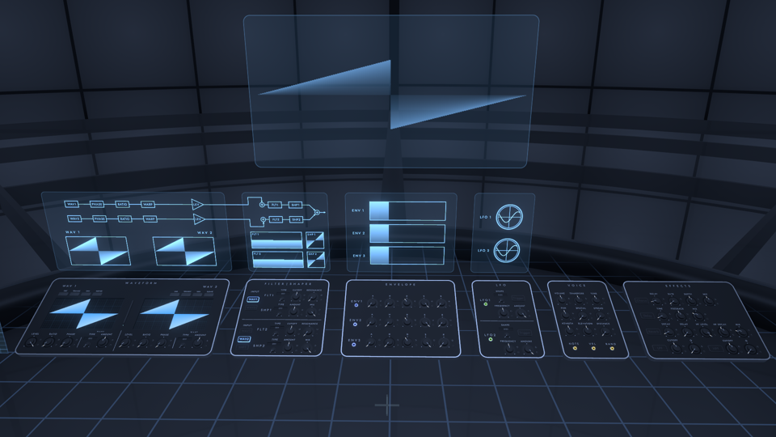
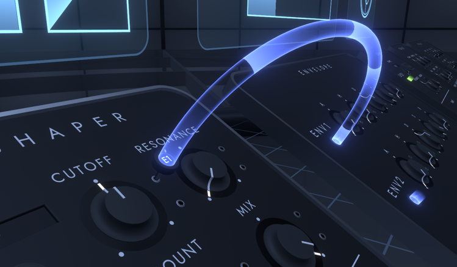

# Synthesizer

You can edit synthesizer parameters and create sounds.
The synthesizer is divided into six panels, which are controlled by knobs and buttons on the panels.
The upper screen shows the status of the synthesizer.

The tone created by the synthesizer is called Instrument.
The Instrument to be edited is the one set in the CONTROL tab of the World menu.

## Operations

* You can change the values of synthesizer parameters by turning the knob in VR, or by dragging the mouse up and down on the knob on the desktop.
* Grabbing the knob twice quickly will return the parameter to its default value.
* You can use the pen on the WAVEFORM panel to draw waveforms. After holding the pen in the center of the panel, USE the pen tip toward the panel's waveform screen to draw a waveform.

### modulation assignment

By assigning modulation to a parameter, you can automatically move the value of the parameter while tones are playing.

* Grab the hole with the light coming out of it next to ENV1, LFO1, etc., and a plug will appear in your hand. In this state, you can assign modulation by performing the following operations.
    * In VR, let the plug touch the jack to the right of the knob.
    * On the desktop, align the reticle with the jack hole to the right of the knob and click.
* After assignment, the amount of modulation can be changed by turning the plug in the same way as the knob.
* To unassign a modulation, pull out the plug in VR or move back while grabbing the plug in desktop.
* Up to 16 modulations can be assigned.

## WAVEFORM

You can configure settings related to waveforms.

* SINE/TRIANGLE/SAW/SQUARE: Select a preset waveform
* LEVEL: Volume loudness of the waveform
* RATIO: Frequency multiplier of waveform
* PHASE: Phase of the waveform
* WARP: Set the warp effect to deform the waveform
    * TYPE: Type of warp effect
        * SYNC: Oscillator sync
        * BEND: Distorts the waveform, shrinking it to the center or stretching it from the center
        * PWM: Shrinks the waveform toward the center
        * ASYM: Move the center of the waveform left or right
        * FLIP: Flip part of the waveform upside down
        * MIRROR: Align the original waveform and the inverted waveform left and right, and move the center of the each waveforms left and right
        * DOWNSMP: Reduce the sampling frequency of the waveform
        * PM: Phase modulation from the other waveform
        * RM: Ring modulation from the other waveform
        * NOISE: Mix noise at the sampling position of the waveform
    * AMOUNT: Amount of warp effect

When a preset waveform is in use, the waveform display on the panel is dimmed.
In this case, the preset number is recorded in the save data instead of the waveform data, thus shortening the length of the save data.

The top screen shows the waveform processing flow and the output waveform after WARP is applied on each waveform.

## FILTER | SHAPER

Filters (FLT) and shapers (SHP) can be applied to the waveform.

* INPUT: Specifies which waveforms are input for the FLT1 and FLT2 inputs. WAV1 and WAV2 are bypassed to FLTs if not input to either FLT and mixed at the end. SHP1 is input to FLT2 if it is on and mixed at the end if it is off.
* FLT1/FLT2:
    * TYPE: Filter type
        * LP: Low pass filter
        * HP: High pass filter
        * BP: Band pass filter
        * NOTCH: Notch filter
    * CUTOFF: Cutoff frequency of the filter
    * RESONANCE: Resonance value of the filter
* SHP1/SHP2: Shaper shaping frequency
    * TYPE: Shaper type
        * SOFT CLIP: Smoothly clips the waveform at the top and bottom
        * HARD CLIP: Clips the waveform vertically above and below the peak
        * LIN. FOLD: Folds the waveform vertically
        * SINE FOLD: Folding by applying a sine function to the waveform
        * BITCRUSH: Lower the number of quantization bits in the waveform
        * DOWNSMP: Reduce the sampling frequency of the waveform
    * AMOUNT: Strength of the shaper effect
    * MIX: Amount of mix between the original waveform and the waveform after the shaper is applied

The upper screen shows the processing flow of the applied filter and shaper, as well as a graph showing the frequency response of the filter and the relationship between the input and output of the shaper.

## ENVELOPE

ENVELOPE generates modulations that change with time from note on and note off.
Three envelopes are available in Fractone.
ENV1 by default modulates for the VOLUME of the VOICE.

* A: Attack Time. The time it takes for the modulation value to go from 0 to the maximum value immediately after note on.
* H: Hold time. The time after attack that the modulation value remains at its maximum value.
* D: Decay time. The time from the maximum modulation value to the sustain value after a hold.
* S: Sustain value. The modulation value after decay.
* R: Release time. Time from note off until the modulation value reaches 0.

The upper screen shows a graph of the modulation value versus time for each envelope.
The unfilled portion of the graph represents the release section.

## LFO

The LFO (Low Frequency Oscillator) produces a periodically changing modulation.
Two LFOs are available in Fractone.

* SHAPE: Selects the waveform of the LFO.
* TRIGGER: Specifies whether the phase of the LFO waveform is reset when a sound is played.
* FREQUENCY: Frequency of the LFO waveform.
* AMOUNT: Amount of LFO effect.

The top screen shows the status of each LFO waveform.

## VOICE

You can make settings related to the sound source.

* VOLUME: Sound volume
* TRANSPOSE: Changes the pitch in a range of 2 octaves up or down
* TUNE: Changes the pitch by one semitone up or down
* PAN: Sets the panning of the sound
* SPATIAL: Amount of stereophonic sound effect, corresponds to the Spatial property of Unity's AudioSource.
* SPREAD: The spread of the sound when the stereophonic sound effect is applied, corresponding to the Spread property of Unity's AudioSource.
* AZIMUTH: Azimuth angle of the sound source location
* ELEVATION: Elevation angle of sound source location
* DISTANCE: Distance of the sound source from the center
* Modulation:
    * NOTE: Pitch of the note
    * VEL: Velocity of the note
    * RAND: Random value per note

## EFFECTS

Audio effects can be applied to audio.
Pressing the button with the name of each effect toggles between enabling and disabling the effect.
The effects are implemented by Unity's Audio Filter component.

### Chorus

Applies a chorus effect to audio.
Corresponds to Unity's AudioChorusFilter.

* DELAY: Delay between the original sound and the sound after chorus is applied, corresponding to AudioChorusFilter.delay.
* RATE: Frequency of chorus modulation, corresponds to AudioChorusFilter.rate.
* DEPTH: Depth of modulation in chorus, corresponds to AudioChorusFilter.depth.
* MIX: The amount of mix between the original and the chorus applied, corresponding to dryMix, wetMix1, wetMix2, and wetMix3 of AudioChorusFilter.

### Delay

Applies a delay effect to audio.
Corresponds to AudioEchoFilter of Unity.

* TIME: Delay from the original sound to the delayed sound, corresponding to AudioEchoFilter.delay.
* FEEDBACK: Decay ratio per delay, corresponds to AudioEchoFilter.decayRatio.
* MIX: The amount of mix between the original sound and the delayed sound, corresponding to AudioEchoFilter.dryMix and wetMix.

### Reverb

Applies a reverb effect to audio.
Corresponds to AudioReverbFilter in Unity.

* DECAY: Decay time of the reverb, corresponds to AudioReverbFilter.decayTime.
* DELAY: Reverb delay time, corresponds to AudioReverbFilter.reverbDelay.
* HF LEVEL: Volume of the high frequency component of the reverb, corresponds to AudioReverbFilter.roomHF.
* HF DECAY: Ratio of decay time between high and low frequency components of the reverb, corresponding to AudioReverbFilter.decayHFRatio.
* MIX: The amount of mix between the original sound and the reverb applied, corresponding to AudioReverbFilter's dryMix and room.

### LPF

Applies a low-pass filter to the audio.
Corresponds to AudioLowPassFilter in Unity.

* CUTOFF: Cutoff frequency, corresponds to AudioLowPassFilter.cutoffFrequency.
* Q: Resonance value, corresponds to AudioLowPassFilter.lowpassResonanceQ.

### HPF

Applies a high-pass filter to the audio.
Corresponds to AudioHighPassFilter in Unity.

* CUTOFF: Cutoff frequency, corresponds to AudioHighPassFilter.cutoffFrequency.
* Q: Resonance value, corresponds to AudioHighPassFilter.highpassResonanceQ.
